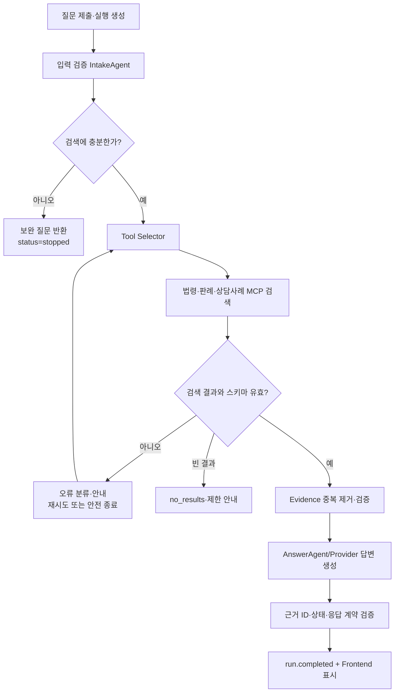

# LawPath 에이전트 아키텍처 설계서

> 작성일: 2026-09-09  
> 대상 브랜치: `develop` 병합 기준  
> 범위: Frontend → Backend Agent → Legal MCP → PostgreSQL/pgvector → Backend 응답 → Frontend

## 1. 서비스 개요

- 서비스명: LawPath 생활 법률 검색 AI Agent
- 목적: 사용자의 주거·노동·소비자 법률 질문을 분석하고, 관련 법령·판례·소비자원 상담사례를 검색해 근거 기반 안내를 제공한다.
- 주요 사용자: 임대차·보증금, 임금·퇴직금, 환불·미배송·중고거래 분쟁을 확인하려는 사용자
- 입력: `category`, `question`, `session_id` 또는 guest 식별자
- 출력: 입력 판단, 분석 답변, 핵심 쟁점, 관련 근거, 보완 질문·주의사항, SSE 진행 상태
- 현재 지원 범위: 법률 정보 검색과 설명. 법률 자문, 승소 보장, 실제 사건 대리 또는 자동 문서 제출은 지원하지 않는다.

### 시스템 구성

```text
Streamlit Frontend
  └─ Backend Agent Run API / SSE
       └─ IntakeAgent → LegalAgentRuntime → MCP tools
            └─ PostgreSQL + pgvector (법령·판례·상담사례)
       └─ AnswerAgent / Provider → 계약 검증된 LegalQuestionResponse
```

## 2. Agent 실행 단계와 실제 구현 매핑

LawPath는 검색 전 검증과 근거 검색을 중심으로 한 단일 Agent Runtime의 순차 실행으로 동작한다. 아래 단계는 코드의 `IntakeAgent`, `LegalAgentRuntime`, `AnswerAgent`, MCP client 및 실행 서비스 역할에 대응한다.

| 단계/노드 | 역할 | 주요 입력 | 주요 출력 |
|---|---|---|---|
| Request Intake | category·question 정규화 및 실행 생성 | 사용자 요청, idempotency key | `run_id`, queued 상태 |
| Validation / IntakeAgent | 질문의 구체성·필수 정보 판단 | category, question | `sufficient`/`proceed_with_caution`/`needs_clarification`, checks, 보완 질문 |
| Clarification Gate | 검색 가능 여부 분기 | Intake 결과 | 검색 중단 또는 Runtime 진행 |
| Tool Selector | 분야와 허용 도구를 기준으로 검색 도구 선택 | AgentProfile, question | 도구 목록과 실행 순서 |
| LegalAgentRuntime | 선택 도구를 순서대로 호출하고 결과 수집 | question, profile | Evidence 목록, trace, 호출 횟수 |
| MCP Search Tools | 법령·판례·상담사례 검색 | question, category, top_k=3 | 검색 결과와 검색 점수 |
| Evidence Validator | 도구 응답 타입·중복·필수 필드 확인 | MCP payload | 정규화된 근거 목록 또는 오류 |
| AnswerAgent / Provider | 근거 안에서 답변과 핵심 쟁점 작성 | question, Evidence | answer, key_issues, used_evidence_ids |
| Response Contract Validator | 상태·근거·입력 판단 결과 검증 | 최종 response | `LegalQuestionResponse` |
| SSE Publisher | 단계 시작·완료와 terminal snapshot 전달 | run 상태, trace | 친화적 진행 이벤트 |
| Fallback / Error Handler | 보완 질문, 빈 결과, timeout, 인증·계약 오류 안내 | 오류 유형 | 안전한 종료와 제한사항 |

## 3. 상태 흐름



실행 상태는 `queued → running → completed | stopped | failed`로 종료한다. `input.required`는 검색 전 보완이 필요한 `stopped` 실행에 사용하며, terminal 이벤트 전에 결과를 저장한다. Frontend는 SSE 연결이 끊겨도 같은 `run_id`의 snapshot을 재조회한다.

## 4. 주요 분기 조건과 폴백

- 질문·카테고리 누락 또는 계약 위반 → 검색 도구를 호출하지 않고 입력 오류 안내
- `needs_clarification` → `follow_up_questions`와 `cautions`를 반환하고 `status=stopped`, 검색 결과는 반환하지 않음
- `sufficient` 또는 `proceed_with_caution` → 검색 진행. 주의 메시지는 유지하되 근거 검색을 중단하지 않음
- 허용 도구가 없거나 최대 호출 수(현재 3회)를 초과 → 실행 실패 및 제한 안내
- MCP 응답 `success=false`, 잘못된 타입, 누락 필드 → 검색 오류로 분류하고 결과를 답변 근거로 사용하지 않음
- 검색 결과가 빈 배열 → `no_results`와 추가 정보 안내. 근거를 임의 생성하지 않음
- Evidence가 3건 미만 → `insufficient_evidence` 또는 제한사항을 표시하고 법률적 단정을 피함
- LLM 출력이 허용된 Evidence ID를 벗어남 → 출력 폐기 후 템플릿 답변으로 폴백
- SSE·HTTP timeout 또는 재연결 → 새 실행을 만들지 않고 기존 `run_id` snapshot 재조회
- 상충 지시(가짜 판례, 승소 보장, 반대 근거 은폐, 비밀 노출) → 실제 근거만 사용하고 확인 질문·제한사항 안내

## 5. 공유 상태 객체와 이벤트

### Agent 내부 상태

| 필드 | 타입 예시 | 사용 노드 | 설명 |
|---|---|---|---|
| `question` | string | 전체 | 정규화된 사용자 질문 |
| `category` | `housing\|labor\|consumer` | Intake/Runtime | Agent Profile 식별 |
| `status` | string | 실행 서비스 | queued/running/completed/stopped/failed |
| `input_assessment` | object/null | Intake/응답 | 상태, checks, 판단 메시지 |
| `current_step` | integer | Runtime | 현재 처리 단계 |
| `tool_calls` | integer | Runtime | 도구 호출 수 |
| `trace` | list[object] | Runtime/SSE | validation·tool 선택·완료 이벤트 원본 |
| `evidence` | list[Evidence] | Runtime/Answer | 중복 제거된 검색 근거 |
| `evidence_count` | integer | Runtime | 근거 수 |
| `termination_reason` | string | 응답 | model_finished/no_results/needs_clarification 등 |
| `answer` | string | AnswerAgent | 최종 설명 |
| `used_evidence_ids` | list[string] | AnswerAgent | 답변에 실제 사용한 근거 ID |

### Frontend 공개 응답

`LegalQuestionResponse`는 `request_id`, `agent_id`, `status`, `termination_reason`, `question_summary`, `key_issues`, `answer`, `input_assessment`, `related_laws`, `similar_cases`, `consultations`, `follow_up_questions`, `cautions`, `is_mock`를 포함한다. `input_assessment`는 기존 응답 호환을 위해 null 또는 누락될 수 있다.

### SSE 이벤트

`run.started`, `step.started`, `step.completed`, `input.required`, `run.completed`, `run.failed`를 사용한다. 사용자 화면에는 내부 도구명 대신 “관련 법률 정보를 확인하고 있어요”, “비슷한 판례를 찾아보고 있어요”, “관련 상담 사례를 확인하고 있어요”와 같은 친화적 메시지를 표시한다.

## 6. 기억과 컨텍스트 관리

- 단기 실행 상태: 현재 질문, 입력 판단, trace, 검색 근거, 답변을 하나의 `run_id`에 연결한다.
- SSE 재연결: `Last-Event-ID`와 run snapshot으로 누락 이벤트를 보완한다.
- 후속 질문: 원래 질문과 추가 정보를 결합해 새 실행을 만들며, 보완 질문 문장 자체를 답변으로 자동 전송하지 않는다.
- 장기 저장: 검색·대화 영구 저장은 현재 Agent Runtime의 메모리 실행 상태와 구분한다. DB 대화 저장이 구현되었다고 가정하지 않는다.
- 컨텍스트 최소화: 모든 과거 대화를 무조건 LLM에 보내지 않고 현재 질문과 필요한 최근 메시지·요약만 사용한다.
- 개인정보: 질문 처리에 불필요한 개인 식별정보와 인증정보를 답변·SSE·로그에 노출하지 않는다.

## 7. 도구 명세

| 도구 | 입력 | 출력 | 실패 처리 |
|---|---|---|---|
| `search_laws` | `question`, `category`, `top_k=3` | 법령 Evidence 배열 | MCP 오류·타입 오류 시 해당 근거 폐기 |
| `search_cases` | `question`, `category`, `top_k=3` | 판례 Evidence 배열 | timeout/빈 결과 안내 |
| `search_consultations` | `question`, `category`, `top_k=3` | 소비자원 상담사례 Evidence 배열 | 빈 결과와 제한사항 반환 |
| `search_legal_documents` | `question`, `category`, `top_k=3` | 문서 items 배열 | Legacy 통합 검색 계약 검증 |

공통 Evidence는 `evidence_id`, `title`, `content`, `source`, `score`와 자료 유형별 메타데이터를 가진다. 검색 점수는 순위 참고용이며 법률 적용 가능성이나 답변 정확도를 의미하지 않는다.

## 8. 종료 조건과 중복 제거

- 입력 보완 필요: 검색 전 `stopped` 종료
- 정상 검색: 모든 선택 도구 처리, 답변 계약 검증 후 `completed`
- 검색 결과 없음: 근거 배열이 비어 있으면 `no_results`
- 근거 부족: 최소 목표 수 미달 시 `insufficient_evidence`와 제한 안내
- 예외: 재시도·재연결 한도 초과 또는 계약 오류 시 `failed`
- 반복 방지: 실행당 도구 호출 수를 제한하고, Evidence ID 또는 문서 ID로 중복 근거를 제거한다.

## 9. 테스트와 검증 계획

1. 대표 질문: 주거·노동·소비자 각 정상 질문이 올바른 Agent와 MCP 도구로 연결되는지 확인한다.
2. 소비자 통합 목표: 법령·판례·상담사례가 각각 3건 반환되고 Frontend 카드에 표시되는지 확인한다.
3. 정보 부족: 검색 호출 없이 보완 질문과 `needs_clarification`이 반환되는지 확인한다.
4. 예외: 빈 결과, timeout, 인증 실패, 잘못된 SSE 이벤트, 최종 응답 계약 오류를 격리 시험한다.
5. 안전성: 가짜 근거 생성, 승소 보장, 반대 근거 은폐, 내부정보 노출 요구를 거부하는지 수동 검토한다.
6. 회귀: 동기 API·SSE 재연결·PDF 내보내기·카드 접기/펼치기와 기존 Frontend 테스트를 함께 실행한다.

현재 시험 결과와 미측정 지표는 [에이전트 시험 결과 보고서](에이전트%20시험%20결과%20보고서.md)에 기록한다.

## 10. 현재 한계와 후속 구현

- 정상 100건 전체의 법률적 정답률은 자동 판정하지 않으며, 근거 관련성·응답 일관성은 수동 평가가 필요하다.
- 자기성찰 적용 전후 비교와 Agent 재시도 횟수 집계 로그는 추가 구현이 필요하다.
- 실행 상태 저장소는 현재 메모리 기반이며, 다중 프로세스 운영 시 Redis 등 공유 저장소 검토가 필요하다.
- 검색 데이터 최신성은 DB 수집·갱신 정책과 MCP 연결 상태에 의존한다.
